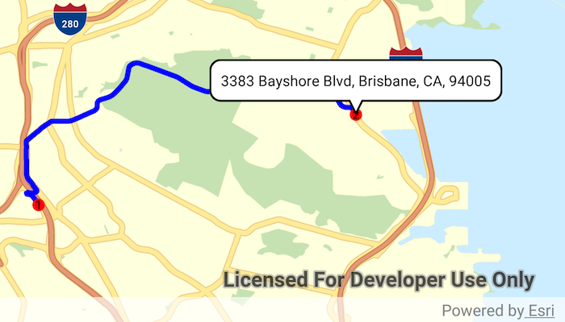

## Mobile Map (Search and Route)
Demonstrates how to search and route using data in a map package.



## How to use the sample
The sample loads maps from a `MobileMapPackage` and displays the first map in the map package (index 0) on the starting activity (MobileMapViewActivity). All maps contained within the map package are shown as a recycler view list in a seperate activity (MapChooserActivity). You can tap on a single map to load its contents to the main `MapView` on MobileMapViewActivity. The map chooser menu indicates if the map has `transportationNetworks` datasets (for routing) or a `LocatorTask` (for geocoding). If the mobile map supports routing or geocoding, you can tap on the map for results.

## How it works
The sample loads a map from a `MobileMapPackage` to instantiate a map package object. It uses the `LocatorTask` property on `MobileMapPackage` to check if the package supports geocoding. It uses the `transportationNetworks` property on each mobile map to see if routing is supported. The logic for routing and geocoding is similar to the one used in the individual routing and geocoding samples.

## Relevant API
* MobileMapPackage
* LocatorTask
* GeoCode
* Route
* NetworkAnalysis
* Callout

## Offline data
1. Download the data from [ArcGIS Online](https://arcgisruntime.maps.arcgis.com/home/item.html?id=260eb6535c824209964cf281766ebe43).  
2. Extract the contents of the downloaded zip file to disk.  
3. Create an ArcGIS/samples/MapPackage folder on your device. You can use the [Android Debug Bridge (adb)](https://developer.android.com/guide/developing/tools/adb.html) tool found in **<sdk-dir>/platform-tools**.
4. Open up a command prompt and execute the ```adb shell``` command to start a remote shell on your target device.
5. Navigate to your sdcard directory, e.g. ```cd /sdcard/```.  
6. Create the ArcGIS/samples/MapPackage directory, ```mkdir ArcGIS/samples/MapPackage```.
7. You should now have the following directory on your target device, ```/sdcard/ArcGIS/samples/MapPackage```. We will copy the contents of the downloaded data into this directory. Note:  Directory may be slightly different on your device.
8. Exit the shell with the, ```exit``` command.
9. While still in your command prompt, navigate to the folder where you extracted the contents of the data from step 1 and execute the following command: 
	* ```adb push SanFrancisco.mmpk /sdcard/ArcGIS/samples/MapPackage```


Link | Local Location
---------|-------|
|[San Francisco Mobile Map Package](https://arcgisruntime.maps.arcgis.com/home/item.html?id=260eb6535c824209964cf281766ebe43)| `<sdcard>`/ArcGIS/samples/MapPackage/SanFrancisco.mmpk |


#### Tags
Routing and Logistics